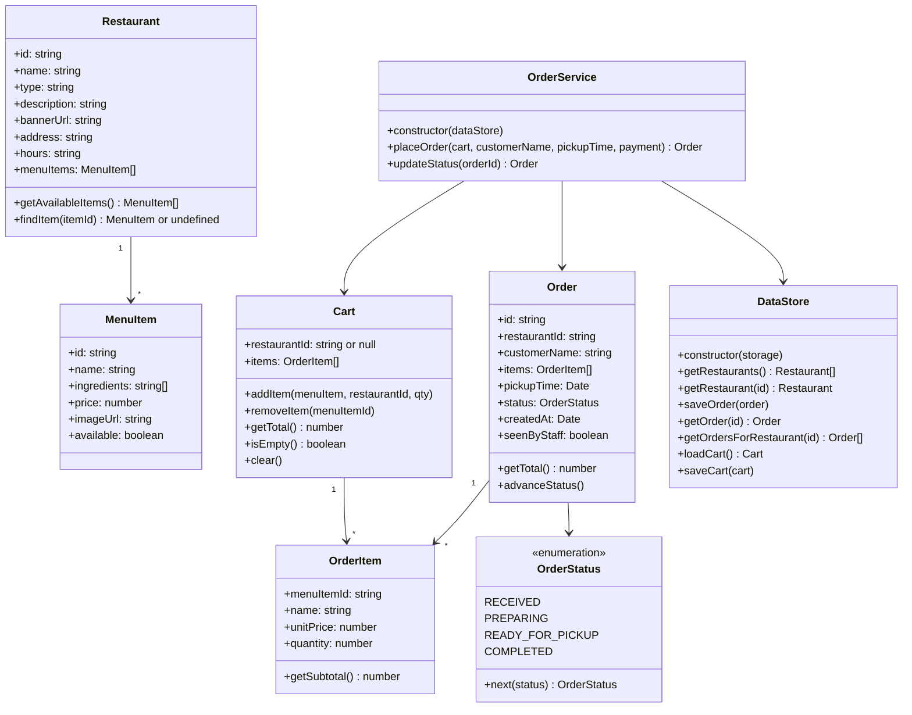

# QuickBite class diagram (Sprint 1)

This file defines the shared classes for Sprint 1, including their names, methods and expected behaviour. Some tasks depend on these classes, so use the definitions below while their implementation is still in progress.

If you need to change a method signature, discuss it with the team first and update this file in your pull request.

## Where each class goes

| Class | File | Issue |
|---|---|---|
| Restaurant | `js/models/Restaurant.js` | #5 View Restaurant Menu |
| MenuItem | `js/models/MenuItem.js` | #5 View Restaurant Menu |
| Seed data (restaurants and menus) | `js/data/seedData.js` | #5 View Restaurant Menu |
| OrderItem | `js/models/OrderItem.js` | #6 View Order's Details |
| Order | `js/models/Order.js` | #6 View Order's Details |
| OrderStatus | `js/models/OrderStatus.js` | #6 View Order's Details |
| Cart | `js/models/Cart.js` | #10 Customer Order Placement |
| OrderService.placeOrder | `js/services/OrderService.js` | #10 Customer Order Placement |
| OrderService.updateStatus | `js/services/OrderService.js` | #7 Update Order Status |
| DataStore | `js/data/DataStore.js` | Shared; included in the initial project structure |

The pages are `index.html` (list of restaurants), `menu.html`, `cart.html`, `order.html` and `staff.html`. Each page gets its own script in `js/views/`.

Tests go in `js/tests/` and are named after the class they test, for example `Cart.test.js`.

## How each class should behave

Use these behaviours as the basis for your tests.

### Restaurant

1. `getAvailableItems()` only returns items where `available` is `true`.
2. `findItem(itemId)` returns `undefined` if there's no item with that ID.

### OrderItem

1. When an item is added, it keeps its own copy of the name and price. That way, if a restaurant changes a price later, old orders still show what the customer actually paid.
2. `getSubtotal()` returns `unitPrice` multiplied by `quantity`.

### Cart

1. Adding an item that's already in the cart increases its quantity instead of adding a second line.
2. Adding an item from a different restaurant than the one already in the cart throws an error.
3. Adding a quantity below 1 throws an error.
4. An empty cart has `restaurantId` set to `null`. The first item added sets it.
5. `removeItem(menuItemId)` removes the whole line. If that leaves the cart empty, `restaurantId` goes back to `null`.
6. `clear()` empties the cart and resets `restaurantId` to `null`.

### Order

1. A new order starts with `status` set to `RECEIVED` and `seenByStaff` set to `false`.
2. `advanceStatus()` moves the order one step forward: `RECEIVED`, then `PREPARING`, then `READY_FOR_PICKUP`, then `COMPLETED`.
3. Calling `advanceStatus()` on a completed order throws an error.
4. `getTotal()` adds up the subtotals of all the items.

### OrderService

1. `placeOrder()` throws an error if the cart is empty, the customer name is blank, the pickup time has already passed, or payment information is missing.
2. If everything is valid, `placeOrder()` saves the order, empties the cart and returns the new order.
3. Payment information is checked but never saved on the order.
4. `updateStatus(orderId)` loads the order, calls `advanceStatus()`, saves it and returns it.

### DataStore

1. The constructor takes a storage object with `getItem()` and `setItem()` methods. In the browser, we pass `localStorage`. In tests, we pass a fake storage object to keep the tests independent of browser storage.
2. Everything is saved as JSON, but the getters return actual class instances, including nested menu and order items, rather than plain objects. When loading an order, `pickupTime` and `createdAt` are restored as `Date` objects.

## Conventions

1. We use ES modules, with exports such as `export class Restaurant` and imports such as `import { Restaurant } from './Restaurant.js'`.
2. Prices are plain numbers in dollars, like `12.5`. Only the views format them for display.
3. All IDs are strings. An empty cart uses `null` for `restaurantId`.

## Details to confirm with the team

- Whether quantities must be positive integers, and how invalid values such as `NaN` should be handled.
- Which payment fields are required for validation.
- Whether `placeOrder()` also saves the cleared cart so it stays empty after refreshing.
- Who creates `OrderService.js`, since #10 and #7 both add methods to it.
